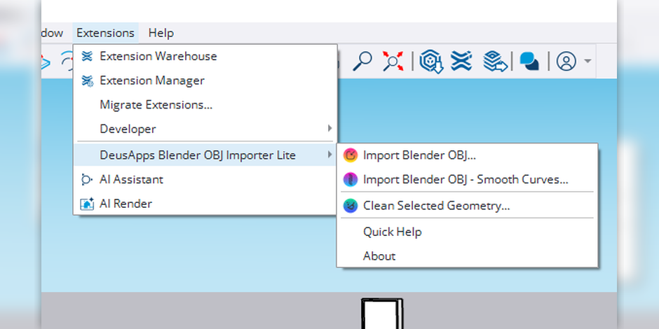
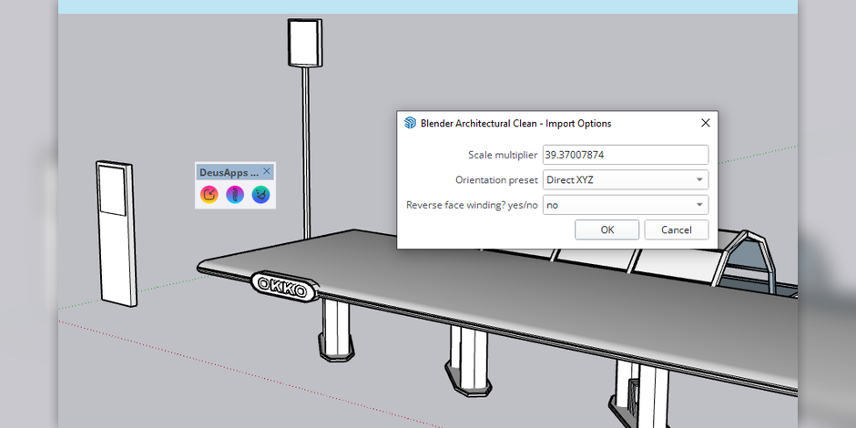

# DeusApps Blender OBJ Importer Lite

**DeusApps Blender OBJ Importer Lite** is a geometry-only Wavefront OBJ importer for SketchUp, optimized for Blender-to-SketchUp workflows.

It imports standard `.obj` files into SketchUp as clean, editable geometry. Blender is the primary tested workflow, but the importer can also be used with OBJ files exported from other 3D tools.

Materials and textures are intentionally ignored to avoid broken material assignments and keep imported models predictable.


## Features

- Import Blender Wavefront OBJ geometry into SketchUp
- Geometry-only import
- Materials and textures are intentionally ignored
- Blender meters to SketchUp inches scale default
- Orientation presets for common Blender-to-SketchUp axis issues
- Architectural clean import mode
- Smooth Curves import mode for cylinders, pipes, columns, and rounded objects
- Clean Selected Geometry tool
- Safer face creation
- Quad repair
- Short-edge cleanup
- Collinear vertex cleanup
- Edge softening and smoothing
- DeusApps toolbar with command-specific icons

## Screenshots

| Menu and toolbar | Import options |
|---|---|
|  |  |

## Recommended Blender export settings

Use:

- **Format:** Wavefront OBJ
- **Selection Only:** ON
- **Apply Modifiers:** ON
- **Write Materials:** OFF

## Installation

### From Extension Warehouse

Install from the SketchUp Extension Warehouse once the extension is approved.

### Manual RBZ install

1. Download the latest `.rbz` from the [Releases](../../releases) page.
2. In SketchUp, open **Window → Extension Manager**.
3. Click **Install Extension**.
4. Select the downloaded `.rbz`.
5. Restart SketchUp if the toolbar does not appear.

## Usage

In SketchUp:

```text
Extensions → DeusApps Blender OBJ Importer Lite
```

Available commands:

```text
Import Blender OBJ...
Import Blender OBJ - Smooth Curves...
Clean Selected Geometry...
Quick Help
About
```

For most architectural models, start with:

```text
Import Blender OBJ...
```

For cylinders, pipes, columns, and rounded parts, use:

```text
Import Blender OBJ - Smooth Curves...
```

After import, select the imported model/group and run:

```text
Clean Selected Geometry...
```

## Orientation notes

Single-axis flips are mirrors. If a model appears upside down, use an orientation preset such as:

```text
Rotate 180 around X
Rotate 180 around Y
```

For the tested Blender-to-SketchUp workflow, **Direct XYZ** or **Rotate 180 around Y** are usually the first presets to try.

## Building the RBZ

From the repo root:

```bash
python scripts/build_rbz.py
```

The RBZ will be created in:

```text
dist/deusapps_blender_obj_importer_lite_v1_0_2_extension_warehouse.rbz
```

The generated RBZ contains the Extension Warehouse-compatible structure:

```text
deusapps_blender_obj_importer_lite.rb
deusapps_blender_obj_importer_lite/
```

## License

This Lite edition is freeware/source-available. See [LICENSE](LICENSE.md).

You may install and use the Lite extension free of charge for personal and commercial SketchUp projects. You may redistribute the original, unmodified RBZ package. You may not sell, repackage, rebrand, or distribute modified versions without written permission from DeusApps.

## Developer

Developed by **DeusApps**.
